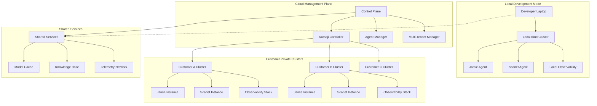
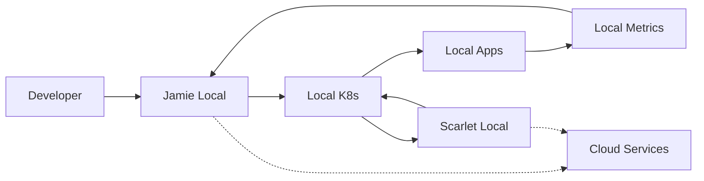
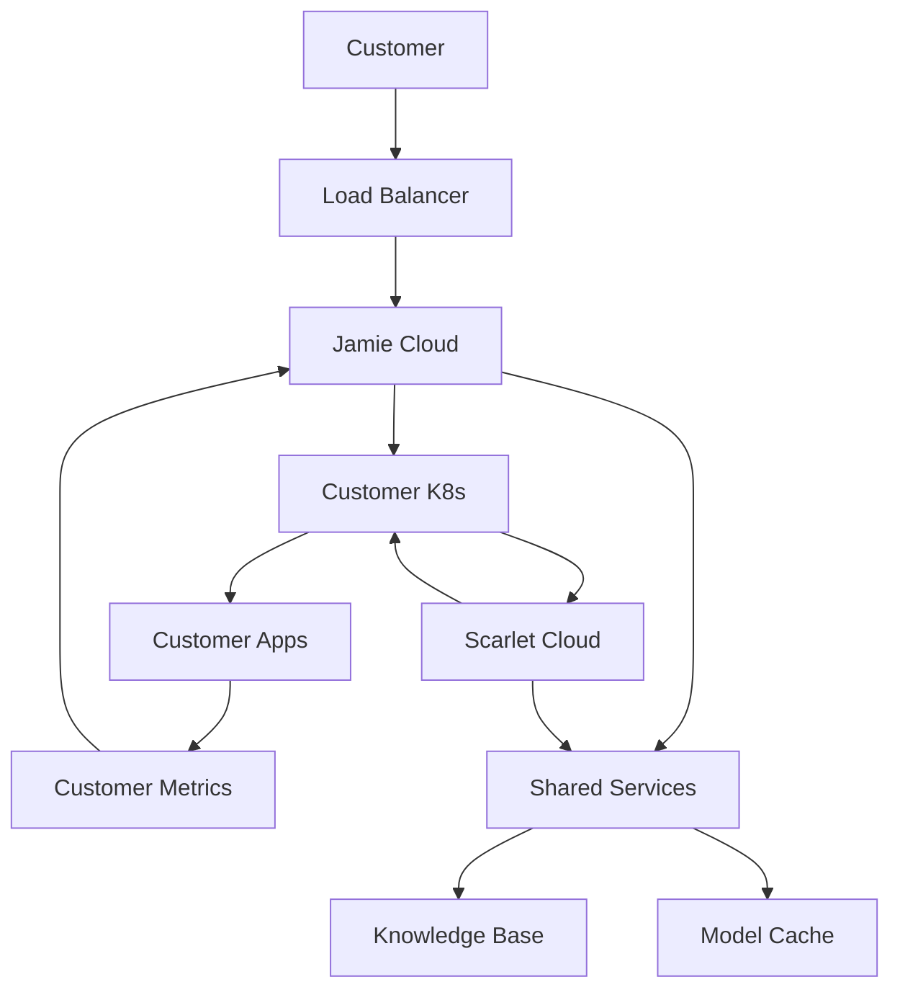

# 🏗️ Auto-DevOps: Dual-Mode Architecture

> **Unified platform supporting both local development and cloud deployment with Kamaji-managed private clusters**

[]()
[]()
[]()
[]()

---

## 🎯 **Architecture Overview**

Auto-DevOps operates in two primary modes:

1. **🖥️ Local Mode**: Developers run Jamie and Scarlet locally for development and testing
2. **☁️ Cloud Mode**: Managed service using Kamaji to provision private clusters for customers



---

## 🖥️ **Local Development Mode**

### **Architecture Principles**
- **Self-Contained**: Everything runs on developer's machine
- **Fast Iteration**: Instant deployment and testing
- **Resource Efficient**: Optimized for laptop hardware
- **Cloud Compatible**: Same APIs and interfaces as cloud mode

### **Components**
```yaml
Local Stack:
  Cluster: Kind (Kubernetes in Docker)
  Agents:
    - Jamie (Local LLM - Llama 3.1 8B)
    - Scarlet (Lightweight automation)
  Observability:
    - Prometheus (minimal config)
    - Grafana (essential dashboards)
    - Loki (local logs)
  Storage:
    - Local SQLite for agent memory
    - Local file system for models
    - Git for configuration sync
```

### **Hardware Requirements**
```yaml
Minimum:
  CPU: 8 cores (M2 Pro / Ryzen 7)
  RAM: 32GB
  Storage: 500GB SSD
  Network: Broadband internet

Recommended:
  CPU: 12+ cores (M3 Max / Ryzen 9)
  RAM: 64GB
  Storage: 1TB+ SSD
  GPU: Optional (for model training)
```

### **Local Development Workflow**
```bash
# 1. Initialize local environment
./scripts/local-setup.sh

# 2. Start local cluster with agents
make local-up

# 3. Develop and test
make test-local

# 4. Deploy changes to local cluster
make deploy-local

# 5. Push to cloud when ready
make cloud-deploy
```

---

## ☁️ **Cloud Deployment Mode**

### **Architecture Principles**
- **Multi-Tenant**: Isolated private clusters per customer
- **Scalable**: Horizontal scaling across regions
- **Secure**: Network isolation and RBAC
- **Managed**: Automated provisioning and maintenance

### **Kamaji Integration**
```yaml
Kamaji Role:
  - Provision customer Kubernetes clusters
  - Manage cluster lifecycle (create, update, delete)
  - Handle networking and security policies
  - Provide cluster access credentials
  - Monitor cluster health and capacity

Customer Cluster Features:
  - Dedicated control plane
  - Isolated networking (VPC/VNET)
  - Customer-specific RBAC
  - Private registry access
  - Backup and disaster recovery
```

### **Cloud Components**
```yaml
Management Plane:
  - Kamaji Controller (cluster provisioning)
  - Agent Manager (Jamie/Scarlet deployment)
  - Multi-Tenant Manager (customer isolation)
  - Shared Services (models, knowledge base)

Customer Plane:
  - Private Kubernetes cluster (via Kamaji)
  - Jamie agent (customer-specific context)
  - Scarlet agent (customer-specific policies)
  - Observability stack (customer data)
  - Customer workloads
```

---

## 🔄 **Unified Agent Architecture**

### **Jamie Agent (DevOps Co-Pilot)**
```yaml
Local Mode:
  Model: Llama 3.1 8B (local Ollama)
  Memory: Local SQLite database
  Context: Single developer/team
  Integrations: Local tools and services

Cloud Mode:
  Model: Shared large model with customer context
  Memory: Customer-isolated database
  Context: Customer-specific environment
  Integrations: Customer's tools and services
```

### **Scarlet Agent (Automation Engine)**
```yaml
Local Mode:
  Scope: Local cluster only
  Actions: Development-safe operations
  Learning: Local patterns and preferences
  Autonomy: High (safe local environment)

Cloud Mode:
  Scope: Customer's entire infrastructure
  Actions: Production-grade operations
  Learning: Customer-specific patterns
  Autonomy: Configurable per customer policy
```

### **Shared Agent Features**
```yaml
Common Capabilities:
  - Natural language interface
  - Kubernetes operations
  - Observability integration
  - GitOps workflows
  - Incident response
  - Performance optimization

Mode-Specific Adaptations:
  - Resource constraints (local vs cloud)
  - Security policies (dev vs production)
  - Integration scope (local vs customer)
  - Learning boundaries (personal vs tenant)
```

---

## 🚀 **Deployment Strategies**

### **Local Deployment**
```yaml
Bootstrap Process:
  1. Install local dependencies (Kind, Ollama, etc.)
  2. Create local Kubernetes cluster
  3. Deploy core platform services
  4. Initialize Jamie and Scarlet agents
  5. Set up local observability
  6. Configure development workflows

Tools Required:
  - Docker Desktop
  - Kind (Kubernetes in Docker)
  - Ollama (local LLM serving)
  - Pulumi (infrastructure as code)
  - kubectl, helm, argocd CLI
```

### **Cloud Deployment**
```yaml
Management Plane Setup:
  1. Deploy Kamaji controller
  2. Set up shared services (models, KB)
  3. Configure multi-tenant manager
  4. Initialize agent templates
  5. Set up monitoring and logging

Customer Onboarding:
  1. Provision private cluster via Kamaji
  2. Deploy customer-specific agents
  3. Configure customer integrations
  4. Set up customer observability
  5. Provide access credentials and training
```

---

## 🔐 **Security & Isolation**

### **Local Security**
```yaml
Threat Model:
  - Local development environment
  - Single user/team access
  - Network isolation not critical
  - Focus on preventing accidents

Security Measures:
  - Local authentication only
  - Resource limits on agents
  - Safe default configurations
  - Easy reset/recovery options
```

### **Cloud Security**
```yaml
Threat Model:
  - Multi-tenant cloud environment
  - Customer data isolation
  - Network-level security required
  - Compliance requirements (SOC2, etc.)

Security Measures:
  - Customer cluster isolation via Kamaji
  - Network policies and encryption
  - RBAC and service accounts
  - Audit logging and monitoring
  - Secret management (Vault integration)
  - Zero-trust networking
```

---

## 📊 **Data Flow & Integration**

### **Local Data Flow**


### **Cloud Data Flow**


---

## 🛠️ **Development Workflow**

### **Local Development Cycle**
```bash
# 1. Feature development
git checkout -b feature/new-agent-capability
cd local-dev/
make start

# 2. Test locally
make test-feature
./scripts/validate-agents.sh

# 3. Integration testing
make integration-test

# 4. Commit and push
git commit -m "Add new agent capability"
git push origin feature/new-agent-capability

# 5. Deploy to staging cloud
make deploy-staging

# 6. Production deployment (after approval)
make deploy-production
```

### **Cloud Operations**
```bash
# Customer cluster management
./scripts/cloud/create-customer.sh --name="acme-corp"
./scripts/cloud/deploy-agents.sh --customer="acme-corp"
./scripts/cloud/configure-integrations.sh --customer="acme-corp"

# Multi-cluster operations
kubectl --context=management get kamajiclusters
./scripts/cloud/update-all-customers.sh --version="v2.1.0"

# Monitoring and maintenance
./scripts/cloud/health-check.sh
./scripts/cloud/backup-customer-data.sh --customer="acme-corp"
```

---

## 📈 **Scaling Patterns**

### **Local Scaling**
```yaml
Single Developer:
  - 1 Kind cluster
  - Basic Jamie + Scarlet
  - Minimal observability

Team Development:
  - Shared development cluster
  - Enhanced agent capabilities
  - Team collaboration features
  - Shared knowledge base
```

### **Cloud Scaling**
```yaml
Customer Growth:
  - Horizontal: More customer clusters
  - Vertical: Larger customer clusters
  - Geographic: Multi-region deployment
  - Features: Advanced agent capabilities

Infrastructure Scaling:
  - Management plane auto-scaling
  - Shared services optimization
  - Model serving optimization
  - Global content delivery
```

---

## 🔧 **Configuration Management**

### **Local Configuration**
```yaml
# local-config.yaml
mode: local
cluster:
  type: kind
  nodes: 3
  
agents:
  jamie:
    model: llama3.1:8b
    memory: sqlite://./data/jamie.db
  scarlet:
    autonomy_level: development
    
observability:
  metrics_retention: 7d
  log_level: debug
```

### **Cloud Configuration**
```yaml
# cloud-config.yaml
mode: cloud
management_plane:
  kamaji:
    version: v0.5.0
    regions: ["us-east-1", "eu-west-1"]
  
agents:
  jamie:
    model: shared://large-model
    memory: postgres://customer-db
  scarlet:
    autonomy_level: production
    
customer_defaults:
  cluster_size: medium
  backup_retention: 30d
  monitoring: enabled
```

---

## 🎯 **Migration Paths**

### **Local to Cloud**
```yaml
Development -> Production:
  1. Export local agent configurations
  2. Create customer cluster in cloud
  3. Migrate agent memory/knowledge
  4. Update integrations and webhooks
  5. Validate functionality
  6. Switch traffic to cloud instance

Benefits:
  - Seamless development experience
  - Consistent agent behavior
  - Validated configurations
  - Smooth customer onboarding
```

### **Cloud to Local**
```yaml
Production -> Development:
  1. Export customer-specific configurations
  2. Anonymize sensitive data
  3. Create local development environment
  4. Import configurations for testing
  5. Develop and test improvements
  6. Deploy back to customer cluster

Benefits:
  - Customer-specific issue reproduction
  - Safe testing environment
  - Faster development iteration
  - Risk-free experimentation
```

---

## 📋 **Implementation Roadmap**

### **Phase 1: Local Mode (Weeks 1-4)**
- [ ] Refactor current codebase for dual-mode support
- [ ] Create local deployment scripts and configurations
- [ ] Optimize agents for local resource constraints
- [ ] Set up local development workflows
- [ ] Create local testing framework

### **Phase 2: Cloud Foundation (Weeks 5-8)**
- [ ] Set up Kamaji controller and management plane
- [ ] Create customer cluster provisioning
- [ ] Implement multi-tenant isolation
- [ ] Set up shared services infrastructure
- [ ] Create customer onboarding workflows

### **Phase 3: Unified Experience (Weeks 9-12)**
- [ ] Implement seamless local-to-cloud migration
- [ ] Create unified configuration management
- [ ] Set up cross-mode monitoring and observability
- [ ] Implement customer-specific customizations
- [ ] Create comprehensive documentation

### **Phase 4: Advanced Features (Weeks 13-16)**
- [ ] Multi-region cloud deployment
- [ ] Advanced agent customization per customer
- [ ] Global knowledge base and model sharing
- [ ] Enterprise security and compliance features
- [ ] Advanced analytics and insights

---

## 🎉 **Success Metrics**

### **Local Mode Success**
```yaml
Developer Experience:
  - Setup time: < 15 minutes
  - Agent response time: < 2 seconds
  - Resource usage: < 50% of available
  - Uptime: > 99% during development hours

Development Velocity:
  - Feature development speed: +40%
  - Bug reproduction time: -60%
  - Testing cycle time: -50%
  - Deployment confidence: +80%
```

### **Cloud Mode Success**
```yaml
Customer Experience:
  - Cluster provisioning: < 30 minutes
  - Agent response time: < 1 second
  - Availability: > 99.9%
  - Customer satisfaction: > 4.5/5

Business Metrics:
  - Customer onboarding time: -70%
  - Support ticket volume: -50%
  - Customer retention: +25%
  - Revenue per customer: +40%
```

---

**🎯 Next Step**: Begin Phase 1 implementation with local mode refactoring and dual-mode architecture setup. 